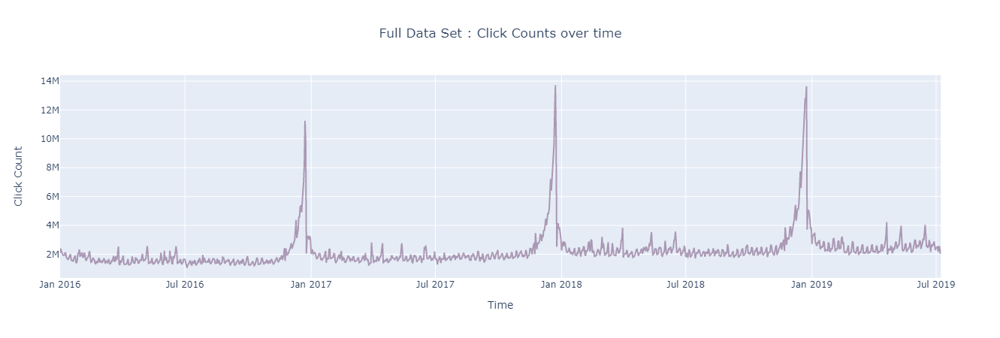
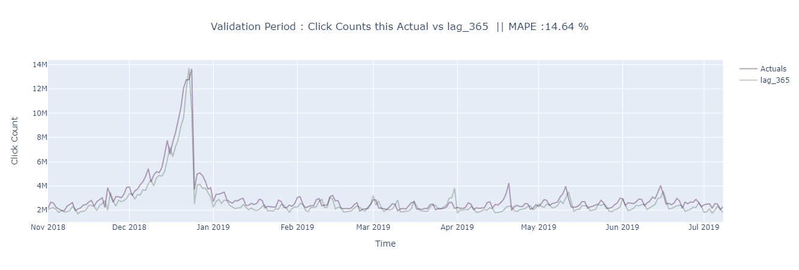
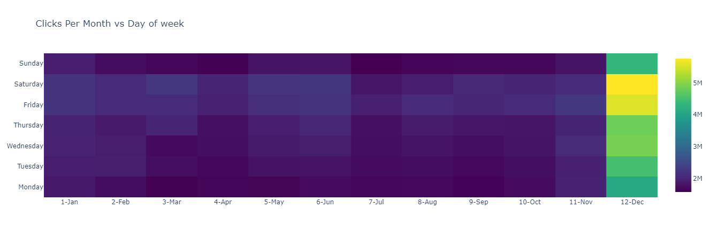
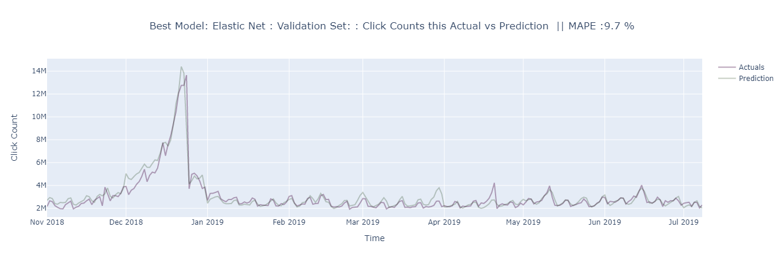
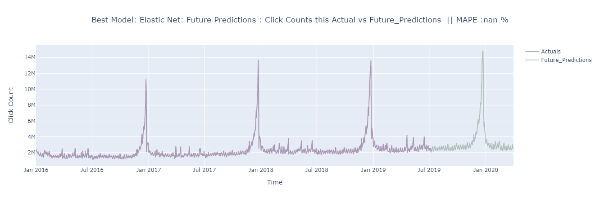

# BlackHawk Click Count Predictions

Main files:
 * `Blackhawk.ipynb` - Jupyter notebook with code, EDA and explanations
 * `ClickCounts.txt` - Txt file with input data

How to reproduce the results and analysis:
1. Ensure `ClickCounts.txt` and `Blackhawk.ipynb` are in the same folder.
2. Run `Blackhawk.ipynb`. It will install two packages `plotly` and `pycaret` and will run all models and generate predictions and plots

---
Overall Plot

---
Baseline Predictions

---
EDA

---
Best Model

---

Future Prediction

---

# Writeup

I used ***Regression Machine learning approach*** to predict future click counts. 

* Elastic Net stand alone gave the best results. It is a relatively simpler modeling technique which has similar interpretability like linear regression. The elastic net method performs variable selection and regularization simultaneously.
Groupings and variables selection are the key roles of the elastic net technique. It can be trained within minutes and can achieve more or less comparable results to other more complex solution.

There is no one way to solve these kind of problems. Methods developed in the 1960s (and some even in the beginning of the 21st century) are still popular, state of the art **Regression Machine learning approach** or fancy neural net techniques.

**Acceptance criteria**
* Our final model performs better than the baseline $\hat{y}_{t} = y_{t-365}$.
Although it took some tuning and creating relevant feature such as Lag variables, Calendar features.

**Additional Possible enhancements**
* Further performance improvements can be made by more feature engineering and better cross validation framework and ensembling methods.

----
## Summary of Analysis
### Data cleaning
1. Reading original txt file
2. Setting the date in standard format; removing whitespaces from columns; replacing spaces from column name with '_'

### Feature engineering
1. Extracted Day from dates, i.e. Monday, Tuesday, Wednesday etc. This will be used as a categorical feature in our models and as activity of users change with days in a week.
2. Extracted Week number from dates, i.e. Week 1, 2 ,3 of the year. As certain weeks in an year have higher activity than others.
3. Extracted Weekday_flg from dates, i.e. Monday, Tuesday have 1; Sat, Sun have 0. This will be used as a categorical feature in our models and as activity of users change on weekends.
4. Extracted Months number from Months, i.e. 1-Jan, 2-Feb. As certain months in an year have higher activity than others, such as Decemeber
5. Extracted Year from dates,  as click count activity is changing year over year. This will help models to differentiate the year. 
6. Created lag_x from historical data, i.e. lag_360, lag_361. This will help model associate the previous years click counts with this years activity. This will also capture, seasonality and holiday effects to a good extend.

### Baseline
-  A naive hypothesis here could be: "tomorrow will be the same as today". However, instead of a model like $\hat{y}_{t} = y_{t-1}$ (which is actually a great baseline for any time series prediction problems and sometimes is impossible to beat), but as we are trying to predict a much longer window into the future, i.e. 9 months, we wont have $y_{t-1}$ available. So, we will instead take the last years value to predict future, take it as a baseline and check if any modeling technique can beat it.

- $\hat{y}_{t} = y_{t-365}$

- The reason of limiting the forecast to next 9 months (March 2020) is to avoid forecast during covid pandemic timeperiod. As historically we havent seen any such event, it would not be wise to expect model trained on historically trends to pick the variations.

### Train model(s) to predict the click counts.

- Using **Regression Machine learning modeling** approach  here rather than traditional time series forecasting methods such as **ARIMA or SARIMA**.
Reasoning here is that new machine learning techniques gives us more model tuning options. But these models cant associate trend and seasonality themselves, that is why feature engineering becomes critical here.
We have already created a few features i.e. **Lag variables, Calendar features**. We can create more features given enough time to improve the performance further.

- Used the following ML algorithms. 
* CATBOOST
* LIGHTGBM
* Elastic Net
* Bayesian Ridge

